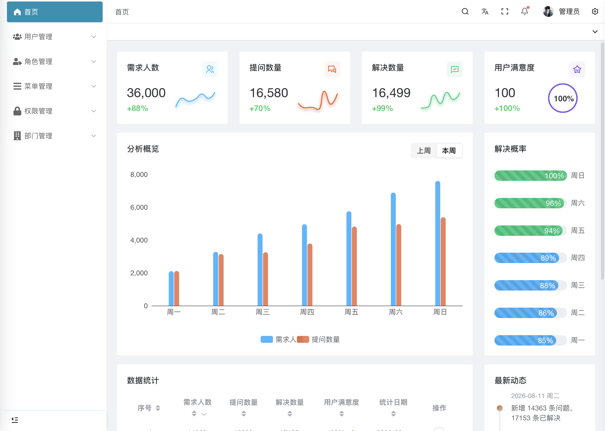
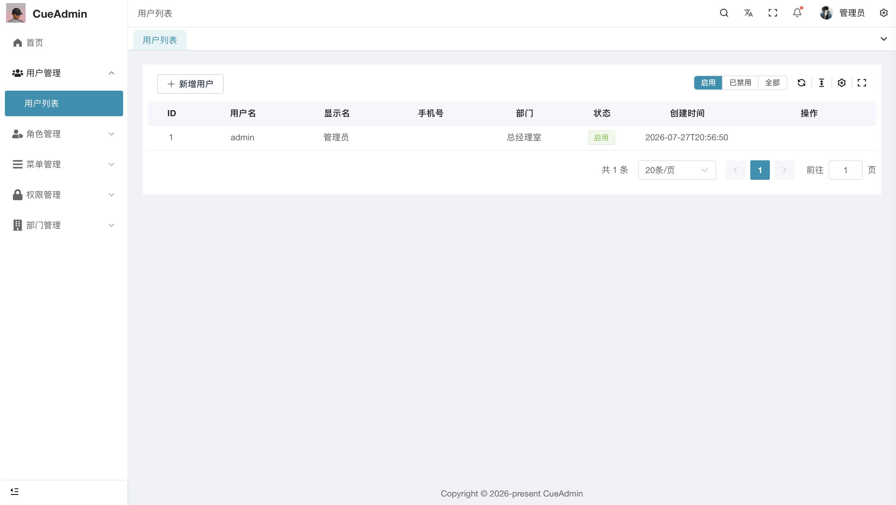
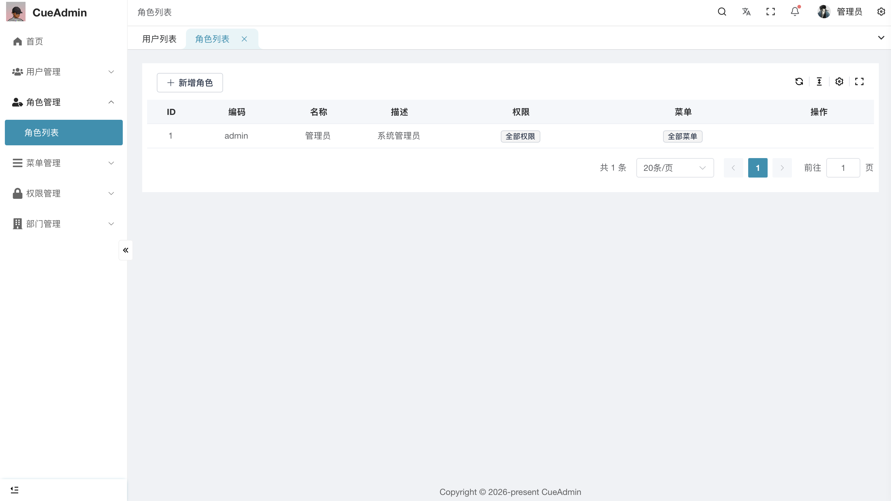
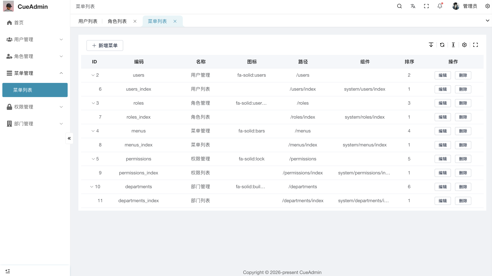
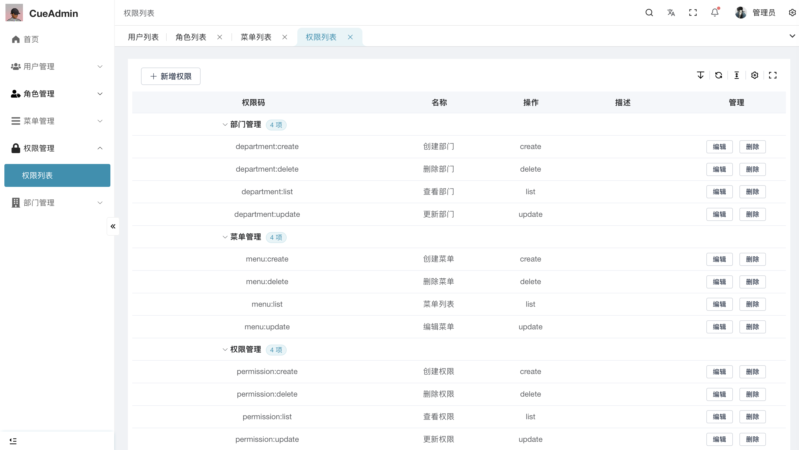
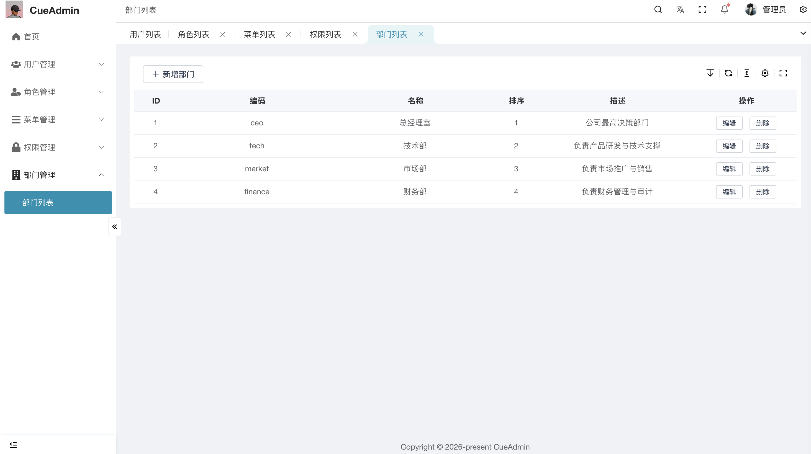

# CueAdmin — 开箱即用的后台管理框架

基于 **FastAPI + Vue 3** 的通用后台管理系统，内置 RBAC 权限、JWT 认证、用户/角色/菜单管理。后端框架从业务项目中剥离而来，前端基于 [vue-pure-admin](https://github.com/pure-admin/vue-pure-admin) 进行定制开发，开箱即用，新项目只需添加业务代码。

[](./LICENSE)
[](https://www.python.org/)
[](https://nodejs.org/)
[](https://fastapi.tiangolo.com/)
[](https://vuejs.org/)

---

## 功能一览

> 📸 **截图示例**：以下为实际运行截图（存放于 `docs/images/` 目录，Markdown 相对路径引用）。

| 登录页 | 仪表盘 |
|:---:|:---:|
|  |  |

| 用户管理 | 角色管理 |
|:---:|:---:|
|  |  |

| 菜单管理 | 权限管理 |
|:---:|:---:|
|  |  |

| 部门管理 |  |
|:---:|:---:|
|  |  |

| 模块 | 功能 |
|------|------|
| 🔐 **认证系统** | JWT 登录/登出、Token 刷新、密码修改、黑名单机制 |
| 🛡️ **权限系统** | RBAC 细粒度权限码、`require_permission("order:export")` 一行鉴权 |
| 👤 **用户管理** | 用户 CRUD、角色分配、软删除、分页、搜索 |
| 🎭 **角色管理** | 角色 CRUD、权限分配、菜单分配 |
| 📋 **菜单管理** | 无限级树形菜单、图标、排序、隐藏/显示 |
| 🔑 **权限码管理** | 权限码 CRUD、分组、Redis 缓存 |
| 🏢 **部门管理** | 组织架构树、部门-用户关联 |
| 📦 **基础设施** | 配置管理、数据库连接池、Redis 缓存、Loguru 日志、统一异常处理 |

---

## 技术栈

| 层 | 技术 |
|----|------|
| **前端框架** | Vue 3 + TypeScript + Vite |
| **UI 组件** | Element Plus + Tailwind CSS |
| **状态管理** | Pinia |
| **后端框架** | FastAPI (Python 3.12+) |
| **ORM** | SQLAlchemy 2.0 (async) |
| **数据库** | MySQL |
| **缓存** | Redis |
| **认证** | JWT (python-jose + bcrypt) |
| **日志** | Loguru |
| **迁移** | Alembic |

---

## 快速开始

### 环境要求

- Python >= 3.12
- Node.js >= 22.18.0
- pnpm >= 10.6
- MySQL 8.0+
- Redis 6.0+

### 1. 克隆项目

```bash
git clone <your-repo-url>
cd CueAdmin
```

### 2. 启动后端

```bash
cd backend

# 创建虚拟环境
python -m venv venv
source venv/bin/activate  # Windows: venv\Scripts\activate

# 安装依赖
pip install -r requirements.txt

# 配置环境变量
cp .env.example .env
# 编辑 .env 填入数据库地址和 JWT 密钥

# 创建数据库
mysql -u root -p -e "CREATE DATABASE cueadmin CHARACTER SET utf8mb4"

# 初始化表结构 + 种子数据（管理员账号、默认角色和权限）
python seed.py

# 启动服务 (默认 http://localhost:8000)
uvicorn app.main:app --reload
```

### 3. 启动前端

```bash
cd frontend

# 安装依赖
pnpm install

# 启动开发服务器 (默认 http://localhost:8848)
pnpm dev
```

### 4. 登录

| 账号 | 密码 |
|------|------|
| `admin` | `admin123` |

打开 http://localhost:8848 ，使用管理员账号登录即可进入后台。

---

## 项目结构

```
CueAdmin/
├── backend/                    # 后端 — FastAPI
│   ├── app/
│   │   ├── api/               # 路由层 — HTTP 端点 + 权限绑定
│   │   │   ├── auth.py            # 登录、登出、/me、改资料
│   │   │   ├── users.py          # 用户 CRUD
│   │   │   ├── roles.py          # 角色 + 权限/菜单分配
│   │   │   ├── menus.py          # 菜单树 CRUD
│   │   │   ├── permissions.py    # 权限码 CRUD
│   │   │   ├── departments.py    # 部门树 CRUD
│   │   │   └── router.py         # 路由聚合 → /api/v1
│   │   ├── services/          # 业务层 — 纯逻辑，不依赖 HTTP
│   │   │   └── auth_service.py   # 登录验证、权限收集、JWT 签发
│   │   ├── models/            # 数据层 — SQLAlchemy ORM 模型
│   │   │   ├── base.py           # TimestampMixin（created_at / updated_at）
│   │   │   ├── associations.py   # M2M 中间表
│   │   │   ├── user.py / role.py / permission.py / menu.py / department.py
│   │   ├── schemas/           # Pydantic — 请求/响应模型
│   │   │   └── response.py       # 统一 ApiResponse + PageData
│   │   ├── core/              # 基础设施
│   │   │   ├── config.py         # .env 配置读取
│   │   │   ├── database.py      # 异步数据库连接池
│   │   │   ├── security.py      # bcrypt 哈希 + JWT 签发/验证
│   │   │   ├── dependencies.py  # Depends 注入链（认证 → 鉴权）
│   │   │   ├── exceptions.py    # 统一异常类 + 错误码
│   │   │   └── error_handler.py # 全局异常处理器
│   │   └── main.py            # FastAPI 入口：生命周期、中间件、异常处理
│   ├── alembic/               # 数据库迁移脚本
│   ├── seed.py                # 种子数据（管理员 + 角色 + 权限 + 菜单）
│   ├── requirements.txt
│   └── .env.example
│
├── frontend/                   # 前端 — Vue 3 + Element Plus
│   ├── src/
│   │   ├── views/             # 页面组件
│   │   │   ├── login/             # 登录页
│   │   │   ├── welcome/           # 仪表盘
│   │   │   └── system/            # 系统管理（用户/角色/菜单/权限/部门）
│   │   ├── router/            # 动态路由 + 权限守卫
│   │   ├── store/             # Pinia 状态管理
│   │   ├── api/               # 后端接口调用
│   │   └── layout/            # 布局系统（侧边栏/顶栏/标签页）
│   ├── package.json
│   └── vite.config.ts
│
├── docs/
│   └── images/                # 📸 README 截图存放目录
├── DESIGN.md                  # 框架设计文档
└── LICENSE
```

---

## 在新项目中使用

只需 3 步，把 CueAdmin 作为新项目的起点：

```bash
# 1. 复制后端框架
cp -r CueAdmin/backend myproject/

# 2. 在 models/ schemas/ services/ api/ 下添加你的业务代码

# 3. 在 api/router.py 注册新路由
api_router.include_router(patient.router, prefix="/patients", tags=["患者"])
```

**核心原则：不改框架文件，只加新的。** 升级框架时只需替换核心文件，业务代码不受影响。

---

## API 文档

启动后端后访问：

- **Swagger UI**: http://localhost:8000/docs
- **ReDoc**: http://localhost:8000/redoc

---

## License

MIT © 2026 [s77mple](https://github.com/s77mple)
